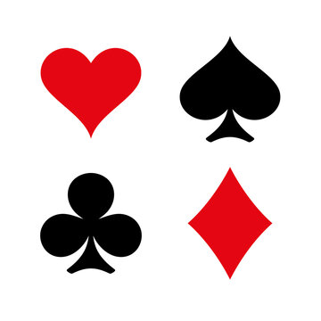

<a name="readme-top"></a>

<!-- PROJECT LOGO -->
<br />
<div align="center">
  <a href="https://github.com/janskn/poker-calculator">
    
  </a>

  <h3 align="center">Poker Calculator</h3>

  <p align="center">
    A calculator to determine your card rank odds
    <br />
    <a href="https://github.com/janskn/poker-calculator"><strong>Explore the docs »</strong></a>
    <br />
    <br />
    <a href="https://github.com/janskn/poker-calculator/issues">Report Bug</a>
    ·
    <a href="https://github.com/janskn/poker-calculator/issues">Request Feature</a>
  </p>
</div>


<!-- ABOUT THE PROJECT -->
## About The Project

This poker calculator for Texas Hold'em determines the odds of each card rank for every stage (Flop, Turn, River).

If there is an occurance of a rank that is covered by a higher rank, it will not be counted. 
Example: Three-of-a-Kind is also a Pair, but in this case, the Pair is not considered.  

Royal Flush is not listed since it is the highest Straight Flush and only has 4 possibilities.

The frontend of this project was made with HTML and Javascript, the calculations are done with Python. Data is exchanged with REST-Api.

Please note that the calculator only considers one players so far.

<p align="right">(<a href="#readme-top">back to top</a>)</p>


### Built With

This project was built with

* HTML
* JavaScript
* Python
* FetchAPI/FastAPI

<p align="right">(<a href="#readme-top">back to top</a>)</p>


### Installation

_Follow these steps to run the project._

1. Install Python
2. Clone the repo
   ```sh
   git clone https://github.com/janskn/poker-calculator.git
   ```
3. Install FastAPI
   ```sh
   pip install fastapi
   ```
4. Install Uvicorn
   ```sh
   pip install uvicorn
   ```

<p align="right">(<a href="#readme-top">back to top</a>)</p>


<!-- USAGE EXAMPLES -->
## Usage

Open the index.html file.
Run Uvicorn from the path of the api.py file
```sh
   uvicorn api:app --reload
```

Simply drag a card into the hand cards or community cards area. 
Once you selected 2 hand cards and at least 3 community cards, the probabilities get displayed.
Remove a card by clicking it.

<p align="right">(<a href="#readme-top">back to top</a>)</p>


<!-- CONTRIBUTING -->
## Contributing

If you have a suggestion that would make this better, please fork the repo and create a pull request. You can also simply open an issue with the tag "enhancement".
Don't forget to give the project a star! Thanks again!

1. Fork the Project
2. Create your Feature Branch (`git checkout -b feature/AmazingFeature`)
3. Commit your Changes (`git commit -m 'Add some AmazingFeature'`)
4. Push to the Branch (`git push origin feature/AmazingFeature`)
5. Open a Pull Request

<p align="right">(<a href="#readme-top">back to top</a>)</p>


<!-- LICENSE -->
## License

Distributed under the MIT License. See `LICENSE` for more information.

<p align="right">(<a href="#readme-top">back to top</a>)</p>

